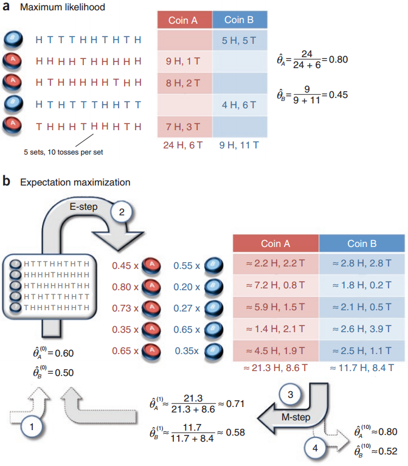

만약 통계 모델이 관측되지 않은 변수에 종속적이라면 모델의 파라미터는 어떻게 구해야 할까? EM 알고리즘은 데이터셋으로부터 얻는 정보가 불완전할 때, 모델의 파라미터를 추정하는 *iterative algortithm*으로써 Expectation(E) 단계와 Maximizing(M) 단계로 구성된다. 

{:height="500px"}

Figure 1. Maximum Likelihood VS. Expectation Maximization

A, B 두개의 동전이 주어진다. 여기서 각 동전의 앞면이 나올 기대값($$\theta_{A}$$,$$\theta_{B}$$)이 얼마일지 계산하는 것이 목표이다. 우리는 한번에 A, B중에서 하나의 동전을 선택하고 10번의 던지기 실험을 한다. 그리고 앞면과 뒷면이 나온 횟수를 각각 카운트한다. 다른 동전을 선택하고 10번의 던지기 실험을 반복한다. 그러면 어렵지 않게 두 동전의 앞면이 나올 확률 기대값을 계산할 수 있을 것이다(Fig.1a).

여기서 선택하는 동전의 종류가 무엇인지 알지 못한다는 가정을 해보자(Fig.1b). 이런 세팅에서도 동전의 앞면에 대한 기대값을 얻을 수 있을까? 여기서 우리가 알고자 하는 것은 각 동전의 앞면이 나올 기대값 뿐만아니라 각 실험에서 선택된 동전의 라벨이다. 

EM 알고리즘에서는 $$\theta_{A}$$, $$\theta_{B}$$에 대한 초기값을 가정한다. 이후 E Step에서는 이 값을 이용하여 각 실험에 사용된 동전의 라벨을 추정한다. M Step에서는 추정된 동전의 라벨을 이용하여 $$\theta_{A}$$, $$\theta_{B}$$를 업데이트한다. 매 스텝마다 바뀌는 동전라벨추정치는 이후 동전앞면기대값을 변경하시킬 것이다. 동전앞면기대값의 변화는 계속해서 동전라벨추정치를 변화시킨다. 변화량의 크기는 스텝에 따라서 점차 작아지게 되고 수렴하게 될 것이다. 

EM 알고리즘이 global minima를 항상 보장하는 것은 아니며 non-concave 함수들에 대해서는 알고리즘을 반본적으로 실행할 필요가 있다.   

### References

[What is the expectation maximization algorithm?](https://www.nature.com/nbt/journal/v26/n8/pdf/nbt1406.pdf)

[A Statistical MT Tutorial Workbook](http://www.isi.edu/natural-language/mt/wkbk.pdf)

